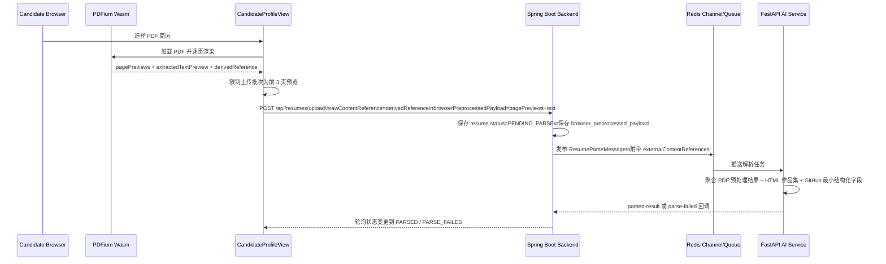

# Phase 3 Wasm PDF 预处理主链路

本文档用于把 Phase 3 中“浏览器端 Wasm 预处理 PDF，再进入多模态解析”的主路径正式写成可答辩、可复核的技术说明，而不只停留在代码里。

## 1. 目标

本项目的正式上传主流程不是把原始重 PDF 直接送进后端，而是：

1. 浏览器端先完成 PDFium Wasm 渲染。
2. 前端生成逐页预览、文本摘要和轻量引用。
3. 上传时只提交轻量引用与受控的分页预处理结果。
4. 后端把上述结果和候选人资料中的 GitHub / 作品集链接一起转发给 AI 服务。
5. AI 服务统一聚合 PDF、HTML、GitHub 三类输入，再输出严格 TalentProfile JSON。

## 2. 实际落地文件

- 前端 Wasm 渲染实现：`frontend/src/wasm/resumePreprocessor.ts`
- 候选人上传入口：`frontend/src/views/CandidateProfileView.vue`
- 后端上传 DTO：`backend/src/main/kotlin/com/smartats/backend/dto/resume/CreateResumeRequest.kt`
- 后端解析转发：`backend/src/main/kotlin/com/smartats/backend/service/ResumeService.kt`
- AI 服务消息结构：`ai-service/app/schemas/resume.py`
- AI 服务统一解析：`ai-service/app/services/parser.py`

## 3. 主流程时序图

## 4. 前端上传策略

### 4.1 浏览器端渲染

- 使用 `@hyzyla/pdfium` 调用 PDFium WebAssembly。
- 对 PDF 逐页生成 JPEG Data URL 预览。
- 同时抽取每页短文本摘要和整体文本预览。

### 4.2 分页上传策略

- 浏览器本地保留完整逐页预览。
- 正式上传负载默认只携带前 `3` 页预览。
- 原因：控制请求体大小、模型输入成本和后端存储压力。

### 4.3 用户可见证据

在 Candidate 上传页中，用户可以直接看到：

- 浏览器端渲染进度条。
- 已完成页数与总页数。
- 轻量引用 `derivedReference`。
- 逐页缩略图。
- 文本摘要与告警信息。

这部分就是答辩中“浏览器端 Wasm 预处理不是口头说明，而是页面可见能力”的核心证据。

## 5. 后端协议

后端接收的正式上传结构包含：

- `rawContentReference`
- `browserPreprocessedPayload`
  - `engine`
  - `mode`
  - `sourceFileName`
  - `sourceMimeType`
  - `sourceFileSize`
  - `derivedReference`
  - `pageCount`
  - `extractedTextPreview`
  - `warnings`
  - `pagePreviews`

后端不会把原始大 PDF 当作主流程长期传输对象，而是把浏览器侧的轻量化结果持久化并继续转发给 AI 服务。

## 6. AI 聚合规则

AI 服务当前统一使用以下上下文源：

1. 浏览器端 PDF 预处理结果：文本摘要 + 分页预览图片。
2. 作品集 HTML：标题、描述、正文文本。
3. GitHub 仓库页面：owner/repo、描述、README 摘要、语言、近期公开信号。

统一聚合后，解析器输出严格 `TalentProfile` JSON，并在失败时走 `parse-failed` 回调。

## 7. 当前限制

- 当前上传默认只附带前 3 页预览，后续可根据样本规模和请求体大小继续调参。
- 当前 GitHub 路径刻意限制为最小公开字段集，不做 commit 级贡献分析。
- 当前仓库已补齐 PDF/HTML/GitHub 样例文件，但最终答辩截图仍建议在运行环境中补采一次真实界面证据。